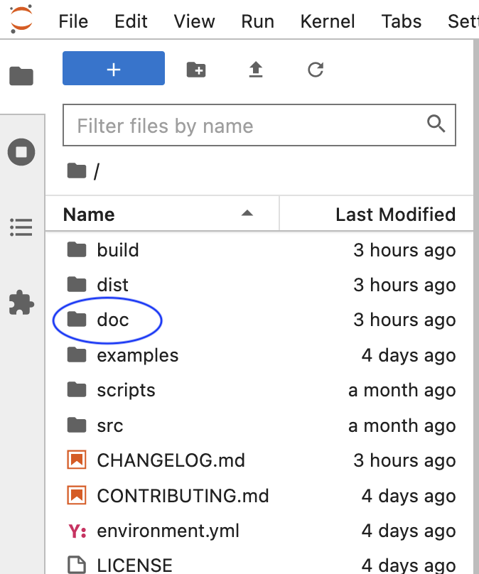

# Writing notebooks

This guide describes how to write notebook tutorials from Jupyter.

First, move to the repository you're contributing to and install invoke:

```sh
pip install invoke
```

Now, configure the development environment (you must have miniconda installed):

```sh
invoke setup
```

At the end of the command, you should see the name of the environment, activate it with:

```sh
conda activate {env-name}
```

## Runnable notebooks

With your environment activated, run the following:

```sh
pip install jupyterlab jupytext
```

Start JupyterLab with:

```sh
jupyter lab
```

Once JupyterLab starts, you'll see the file navigator on the left. Tutorials are always located in the `doc/` directory:



### Editing an existing notebook

We store the notebooks in `.md` format; however, you can open them as notebooks:


### Creating a new notebook

To create a new tutorial, create a new Markdown document:


Then double click on it and add this at the top (do not leave any empty lines):

```md
---
jupytext:
  text_representation:
    extension: .md
    format_name: myst
    format_version: 0.13
    jupytext_version: 1.14.4
kernelspec:
  display_name: Python 3 (ipykernel)
  language: python
  name: python3
---
```

Then, close the file and open it as a notebook as shown in the [Editing an existing notebook section.](#editing-an-existing-notebook)

Remember to add your notebook to `doc/_toc.yml` to ensure it's included in the documentation.